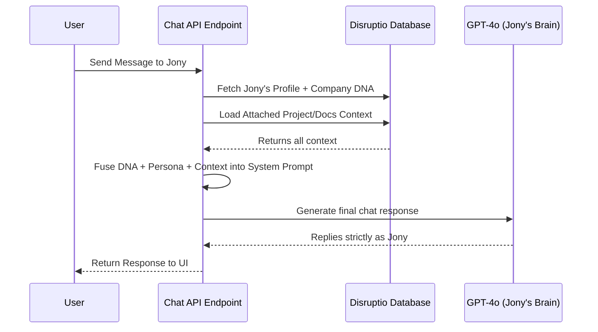
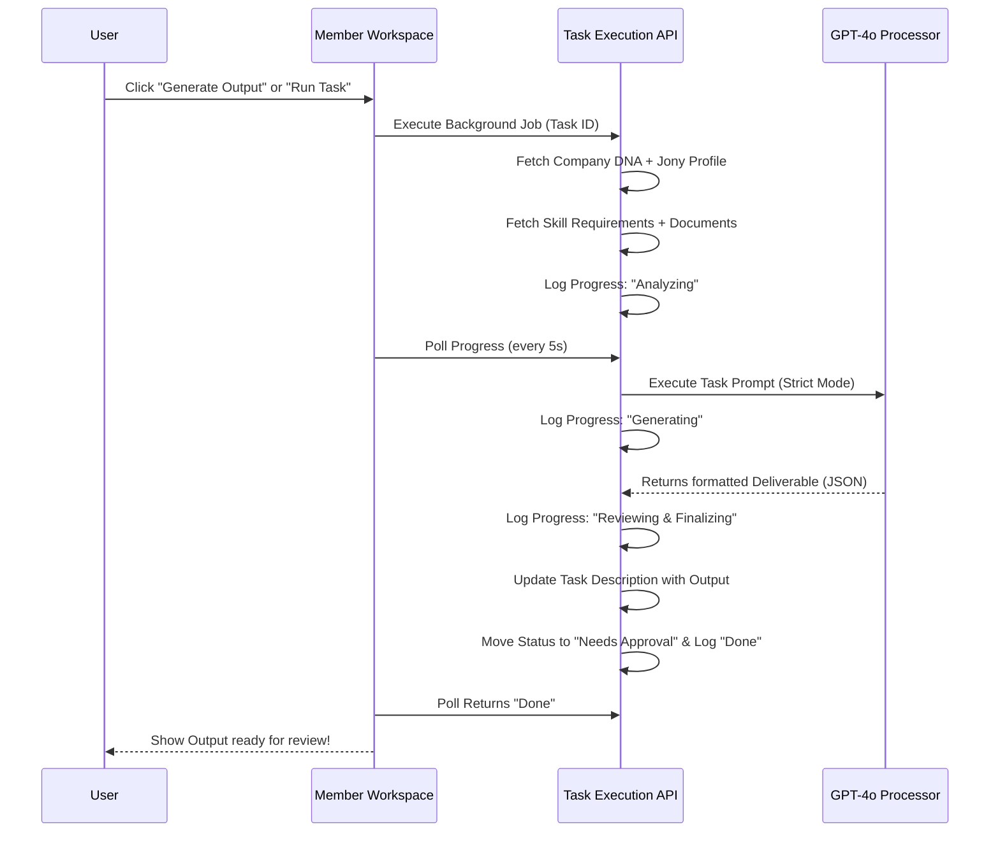

# AI Skills Processing & Workflow Architecture

This document answers how the skills processing workflow currently functions, how different context sources (like Company DNA and Documents) are injected, and how the interaction flows between the user, the AI (e.g., Jony), and the backend systems.

## 1. Chat Interaction Flow (The Iteration Phase)

When you interact with a team member like Jony to brainstorm or prepare a task, **you are talking directly to Jony** (who is instantiated via the LLM). However, Jony is not a blank slate. He doesn't "ping" the company for answers; rather, the company's identity and relevant files are pre-loaded into his sub-conscious (the System Prompt). 

### How it works:
1. **User Interacts:** You send a message in the chat iteration view.
2. **Context Gathering:** The backend API immediately fetches:
   - **Company DNA:** Core values, tone, and brand details.
   - **Jony's Brain Profile:** His persona, advanced instructions, and expected output format.
   - **Project/Document Context:** Any selected documents for the context.
3. **Prompt Construction:** It fuses all of this into a single massive system prompt.
4. **LLM Execution:** The LLM responds *as Jony*, already fully aware of the company context.
5. **UI Update:** You get Jony's response back instantly. No intermediary agent is bouncing messages back and forth.

## 2. Skill Processing & Task Execution Flow

Once you and Jony have iterated enough in chat and generated the required parameters, you click on "Run Task" or "Generate Output." At this point, the system moves from conversational mode to a strict **execution mode** running purely in the background.

### How it works:
1. **Delegation Update:** Jony creates a Task on your Task Board, tracking the parameters.
2. **Execute Call:** The UI fires a `POST` request to the `execute-task` API and goes into "Polling" mode.
3. **Strict Context Gathering:** The backend fetches the Company DNA, Jony's Profile, Documents, AND adds the **Skill Schema/Instructions**.
4. **Background AI Execution:** The LLM is commanded to simply "*Execute this task*" using all the strict contexts provided. 
5. **Real-time Progress Logging:** At different LLM checkpoints, the API logs metadata (`Analyzing`, `Generating`, `Reviewing`, `Finalizing`), which your UI is polling to animate the progress bar.
6. **Task Completion:** Output is successfully parsed into JSON and appended directly to the Task Description, updating the task status to **"Needs Approval"**.

## 3. How Context Hierarchy Shapes Decisions

When the LLM generates output, not all context is weighted equally. The context forms a hierarchy that guarantees the AI respects the brand's identity while still following Jony's personal constraints and the strict technical details of your documents.

| Rank | Context Level | Source | Impact on the Output & Decision |
| :--: | :------------ | :----- | :------------------------------ |
| **1** | **Skill Schemas & Instructions** | Selected AI Skill | **Absolute Law.** This determines the technical output format (e.g., Markdown headers vs JSON arrays). If a skill says "write 5 paragraphs," this overrides the persona trying to write only 2. |
| **2** | **Company DNA** | Global Setup | **The Subconscious Boundaries.** Ensures the tone, audience targeting, and core values are infused automatically. E.g., if DNA states "we are ultra-formal," Jony cannot use emojis, even if he wants to. |
| **3** | **Project & Documents** | User Attachments | **The Factual Grounding.** This is the truth. The AI is instructed to pull factual data strictly from these pieces to prevent hallucinations or making up random stats. |
| **4** | **Member Profile** | AI Team Setup | **The Persona Flavor.** It colors the formatting and language (e.g., Jony as a Design Director might emphasize UX implications, while maintaining the global tone). |
| **5** | **Task Parameters** | Chat Iteration | **The Immediate Scope.** These guide the specific length, exact topic, and language requested in that specific run. |

### Summary Answers
- **Are you talking to Jony or to the Company?** You are talking to Jony, but Jony was instantly "trained" with your Company's DNA right as you interact. They aren't talking back and forth; it's a single brain packed with all the knowledge context.
- **Who executes the skills?** The `execute-task` background endpoint triggers the LLM directly, forcing Jony to snap out of conversational mode into a strict rule-execution mode set by the Task & Skill being used.
